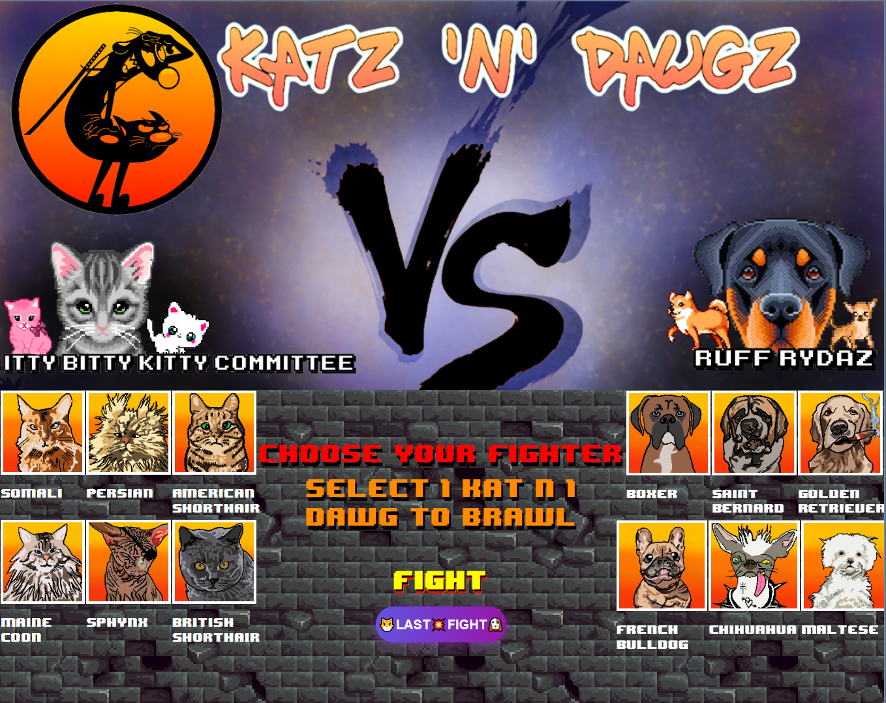
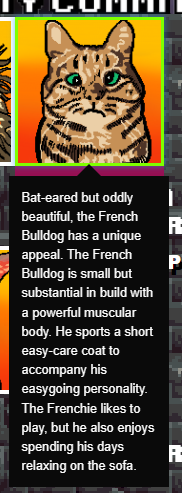
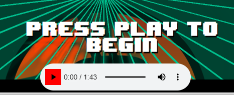
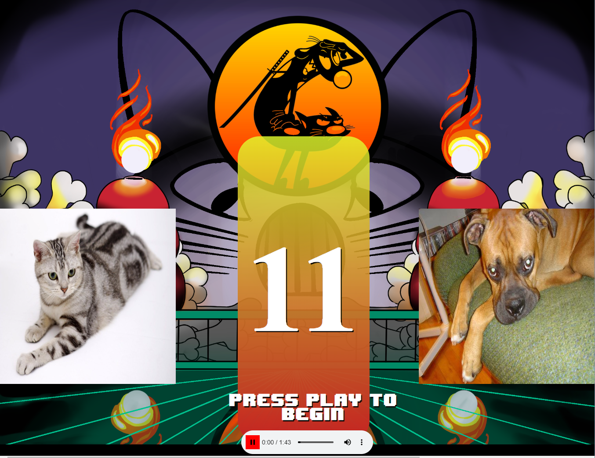
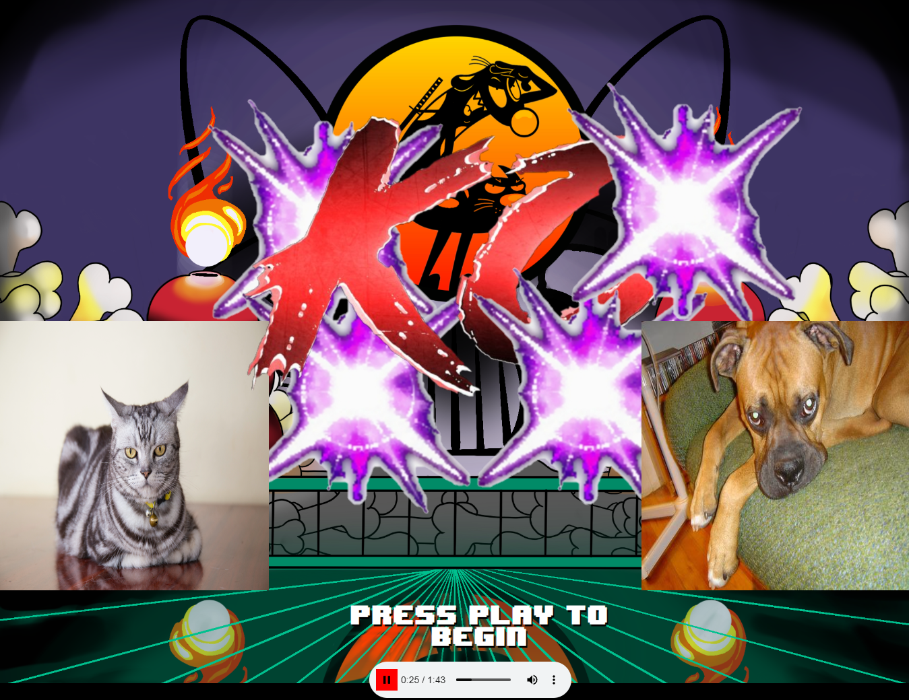
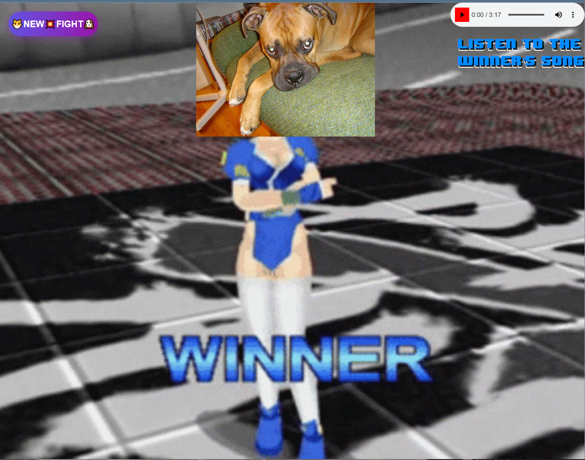

# Group-Project-1 - KATZ 'N' DAWGZ 

A battle for the ages to settle once and for all who the winner is. Cats🐈 or dogs🐕. Pit your adorable weapons of choice against each other to set forth a cacophony of mayhem where only the strongest will survive. 

## You're the Hero 

Select among a wide variety of fighters to pit against each other in the pit. 

## Experience Cutting Edge Graphics & Design

- BEST VIEWING NOTE - If on a laptop (or smaller) screen, the application may be slightly uglier than how it was designed lol. If you have a larger monitor - size the window til the background appears in the screenshots below.

- The Foundation CSS framework brings the action directly from the screen to your brain!

## The Ferrari of Fighting Pits

Multiple server-side APIs lock you into the action by(add)

# Technologies Used
* CSS
* JS
* HTML
* Procreate
* Youtube/mp3
* PC/MAC/iPad

# Link to Deployed URL

https://sanmcc.github.io/lyric-dawg/

# Screenshot

- Home Page - Brings you to the home page of the website. Here you will select one cat fighter and one dog fighter. Once you are ready, you can click 'FIGHT' to start, or 'LAST FIGHT' if you want to view the winner of the last fight (if there has been one)

- This is a tool-tip where you can learn a little bit about the breed by hovering over the fighter's image.

- After selecting 'FIGHT' you will be brought to the main fighting arena. The fighting begins once you press the play button on the audio element at the bottom.

- Once you hit play - a countdown begins as the music starts. The fighting (randomized, sorry you don't REALLY get to play lol) begins at 0seconds.

- When the fighting has ended, you will see a KO pop up on screen before it brings you to the winner's page.

- This is the winner's page. If the dog wins - the dogs face appears on top of the girl's body and a dog song is available to listen to in the top right of screen. This is the same for a cat if a cat wins as far as the picture and a cat song. In the top left, you can go back to the home page and select new fighters.

### <u> Support:  </u>

- [MDN](https://developer.mozilla.org/en-US/)  
- [Google](https://Google.com) 
### <u>Resources:</u>

- https://www.akc.org/dog-breeds/boxer/
- https://www.akc.org/dog-breeds/st-bernard/
- https://www.dailypaws.com/dogs-puppies/dog-breeds/golden-retriever
- https://dogtime.com/dog-breeds/french-bulldog#/slide/1
- https://dogtime.com/dog-breeds/chihuahua#/slide/1
- https://dogtime.com/dog-breeds/maltese#/slide/1
- https://en.wikipedia.org/wiki/Somali_cat
- https://en.wikipedia.org/wiki/Persian_cat
- https://www.hillspet.com/cat-care/cat-breeds/american-shorthair
- https://www.dailypaws.com/cats-kittens/cat-breeds/maine-coon
- https://www.hillspet.com/cat-care/cat-breeds/sphynx#:~:text=The%20sphynx%20is%20a%20medium,medium%20sized%20but%20nicely%20muscled.
- https://www.purina.co.uk/find-a-pet/cat-breeds/british-shorthair#:~:text=The%20British%20Shorthair%20is%20a,expression%20and%20bags%20of%20character.
- https://www.google.com/url?sa=i&url=https%3A%2F%2Ftenor.com%2Fview%2Fdead-or-alive-kasumi-winner-bounce-girl-fight-gif-18152373&psig=AOvVaw1bi21W9l005mpRaOO_Qkmy&ust=1676579962540000&source=images&cd=vfe&ved=0CA8QjhxqFwoTCMCv2p6xmP0CFQAAAAAdAAAAABAJ
- https://youtu.be/YuzfIDGpPgk
- https://youtu.be/IcX5wRMaojU
- https://youtu.be/nhhyvNNKTCI

### <u> Contact: </u>

- [Contact - Future Coder - Daniel Liljegren](mailto:dahneel@gmail.com)
- [Contact - Future Coder - Scott Schulman](mailto:scott.schulman84@gmail.com)
- [Contact - Future Coder - Saniyya Mcclendon](mailto:saniyya.mcclendon@gmail.com)
- [Contact - Future Coder - Joseph S. Ortega](mailto:MyAgentOrtega@gmail.com)

### <u> Authors & Acknowledgement </u>

Thank you to all our peers, tutors and instructors that helped us along the way!

### <u> License </u>

